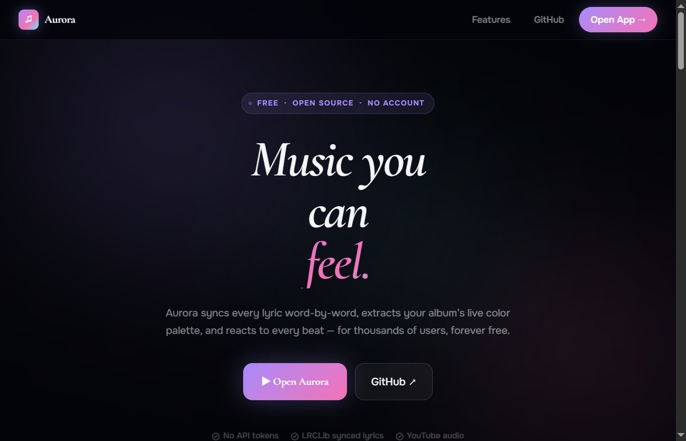

# Aurora Player

> Music you can feel — word-level karaoke, beat-reactive visuals, YouTube integration.

[](https://aurora-player-tpainn.vercel.app/)
[](LICENSE)
[](https://react.dev)



---

## What it does

Aurora syncs every lyric word-by-word as the song plays, extracts the album's live color palette, and reacts to every beat — free, no account required.

| Feature | Detail |
|---|---|
| Word-level karaoke | Enhanced LRC + Rich Sync — each word highlights on beat |
| Beat-reactive canvas | Background animations that pulse with the music |
| YouTube integration | Official video/audio plays behind the lyrics |
| Adaptive palette | Material You colors extracted from every album cover |
| Section detection | Verse / chorus / bridge each trigger different visuals |
| Zen mode | Distraction-free full-screen lyrics |
| PWA | Installable on mobile, offline shell |

## Stack

| Layer | Tech |
|---|---|
| Frontend | React 19 · Framer Motion · Vite 8 |
| Backend | Node 22 · Express · TypeScript |
| Lyrics | LRCLib · Genius · Musixmatch (RapidAPI) |
| Music meta | iTunes Search API |
| Video | YouTube IFrame API |
| Deploy | Vercel · Render |

## Quick start

```bash
git clone https://github.com/TPAINN/aurora-player.git
cd aurora-player
npm install && npm install --prefix server
cp server/.env.example server/.env
npm run dev
```

Open **http://localhost:5173**

**`server/.env`**
```
GENIUS_ACCESS_TOKEN=
RAPIDAPI_KEY=
PORT=3001
```

## License

MIT
